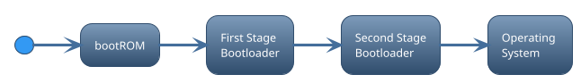
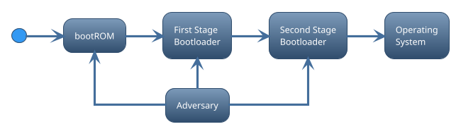
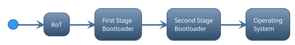
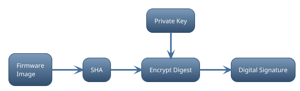
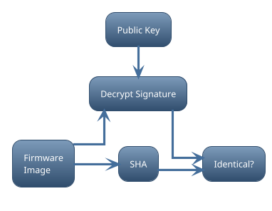

# Abstract

Standard non-secure bootloaders often just rely on a simple checksum to ensure
the next image is whole before it is accepted and executed. From a security
perspective, this is quite dangerous as it provides no mechanism to protect the
embedded system from low-level malware and being seized by an adversary. Nearly
every embedded system requires some level of security to ensure the device
cannot be easily compromised or tampered with. This is especially true with the
proliferation of Internet of Things (IoT) where applications are migrating to
edge devices. The presence of low-level malware may allow adversaries to steal
intellectual property and sensitive data, gain unauthorized access to other
inter-connected systems, or disrupt business-critical operations.

Secure Boot represents the first layer (or barrier) for any layered security
approach and provides the initial boot-up protections to ensure only legitimate
firmware is allowed to execute before loading the Operating System (OS).
Developing a secure boot solution requires not only hardware support for
security related controls, but also embedded engineers with understanding of the
hardware capabilities and secure boot solutions needed to ensure higher-layer
security controls can be trusted.

# Acronyms

| Abbreviation | Meaning                                           |
| :----------- | :------------------------------------------------ |
| CoT          | Chain-of-Trust                                    |
| ECDSA        | Elliptic Curve Digital Signature Algorithm        |
| FIPS         | Federal Information Processing Standards          |
| HSM          | Hardware Security Module                          |
| IoT          | Internet-of-Things                                |
| OEM          | Original Equipment Manufacturer                   |
| OS           | Operating System                                  |
| PKI          | Public Key Infrastructure                         |
| ROM          | Read-only Memory                                  |
| RoT          | Root-of-Trust                                     |
| RSA          | Rivest-Shamir-Adleman (A public-key cryptosystem) |

# Disclaimer

Any mention of commercial products or reference to commercial organizations is
for information only; it does not imply recommendation or endorsement by the
author(s), nor does it imply that the products mentioned are necessarily the
best available for the purpose.

# Scope & Audience

This document is mostly targeting secure boot for embedded systems such as
microcontrollers or application processors used in IoT edge devices. However,
many of the principles discussed within this document are applicable to other
general purpose computing systems. The primary audience for this document are
embedded security engineers and system architects. However, other
hardware/software engineers may benefit from reading this document as well.

# Introduction

A bootloader is a program that is executed on a device when it is powered on or
reset. Bootloaders come in many flavors and sizes, but in general bootloaders
aim to facilitate the following primary goals:

- Prepare the hardware and the runtime environment before loading the Operating
  System (OS) or main application.
- Allow the system software to be updated without the need for specialized
  hardware equipment such as a JTAG programmer.

A central boot program found in embedded processors is the Boot ROM - An
immutable piece of code stored in mask ROM or write-protected flash inside the
processor. It is the first significant code that is executed by the processor
after power-on or reset, and contains instructions for initial hardware setup
needed to boot the next image. Where and how to load and execute the next image
from, and in which order, is in many cases configurable through strap pins,
electronic fuses, or internal flash settings. The Boot ROM may contain
additional functionality, possibly extendable to user code during or after boot,
such as the ability to verify the next image for validity and correctness before
transitioning control. The capabilities of the Boot ROM varies from processor to
processor, but in most cases the Boot ROM is not flexible enough to support
complex boot-up requirements such as loading an operating system from a file
system. In most cases, more than one bootloader is required to accomplish the
task of updating or booting the system - A so-called multi-stage boot process,
where each stage in the boot sequence executes its own boot program with
specific set of capabilities and responsibilities.

The number of stages required to complete the boot process depends on the
processor. On microcontrollers, the Boot ROM itself is capable of starting the
main application residing in internal flash. However, a separate bootloader is
usually required to support updating the main application. On an application
processor capable of running embedded Linux, a so-called Secondary Program
Loader (SPL) that fits into On-Chip RAM (OCRAM) is required to initialize
external RAM before loading and executing the OS loader (i.e. U-Boot). The OS loader will then
take care of loading the Linux kernel and its data (i.e. devicetree and
ramdisk).

Regardless of the number of stages required to boot the device, it's important
to note that bootloaders runs on the system with a very high level of privilege.
Standard non-secure bootloaders often just rely on a simple checksum (i.e.
CRC32) to ensure the next image is whole before it is allowed to execute. From a
security perspective, this is quite dangerous as it allows the presence of
low-level malware.

Low-level malware targets boot firmware due to its unique role in setting up and
maintaining device hardware security capabilities. If a device allows the presence
of low-level malware, it may enable adversaries to steal intellectual property,
credentials and other sensitive or confidential data. Low-level malware may do
so without leaving an audit trail, allowing the malicious program to run on the
device undetected for a prolonged period of time (if detected at all). It may
also serve as a starting point to compromise other devices in a distributed
system, or even worse, render the device unusable or permanently damaged which
can disrupt business and safety-critical operations - potentially leading to
substantial financial costs or health hazards.

Nearly every embedded system requires some level of security to ensure the
device cannot be easily compromised or tampered with. Secure Boot represents the
first layer for any layered security approach and provides the initial boot-up
protections to ensure higher-layer security controls can be trusted by only
allowing legitimate firmware to be executed.

# Secure Boot

The primary purpose of secure boot is to ensure only legitimate and authorized
firmware are allowed to execute before the OS (or main application) is loaded.
To prevent malicious code from compromising the boot process, secure boot relies
on a Chain-of-Trust (CoT) - a method whereby each boot image is required to
cryptographically validate the digital signature of the next image (or any
pertinent boot component) against known and trusted keys before transitioning
control.

If a problem is detected during the secure boot process the bootloader halts the
system from booting further, and may subsequently initiate a recovery process to
restore the device back to a state of integrity. Recovery mechanisms may include
loading an older version that was previously known to work or allow recovery
images to be downloaded locally or remotely through an authenticated update
mechanism.

## Root-of-Trust

The Secure Boot CoT can only be trusted if it originates from an immutable
hardware-level Root-of-Trust (RoT), which typically includes (but not limited
to):

- A primary bootloader that supports secure boot
- A hardware-accelerated cryptographic engine
- Critical configuration settings
- A place to safely store trusted keys

Preferably, the Boot ROM code should support secure boot since it is already
immutable and thus implicitly considered a trusted software component. Note
however, that Boot ROM code, like any other piece of software, can suffer from
security vulnerabilities and bugs which may impact the secure boot process.
Hence, it is important to check whether or not the processor has any known
security vulnerabilities during hardware selection. If the Boot ROM does not
implement a secure boot feature, which may be the case for microcontrollers, it
may be possible to extend the Boot ROM with a secure bootloader stored in a
permanently write-protected flash area.

Critical configuration settings include policies and settings that may alter the
behavior of the boot process. Such as what boot devices to boot from and in what
order, whether or not the processor allows direct boot to external memory, or if
secure boot or debug ports are enabled.

The trusted keys are essential to ensuring trustworthiness of secure boot
process. Depending on the capabilities and requirements of the processor, the
trusted keys could be either a set of X509 certificates, or it could be public
keys in raw format. The latter is more likely to be the case for
microcontrollers. Although the trusted keys are not considered secret, it is
important that the keys cannot be replaced or tampered with. Normally, the keys
are embedded and locked by OEM in one-time programmable memory during device
production to prevent the keys from being modified in the field.

## Digital signatures

Digital signatures employ Public Key Cryptography, a field of cryptographic
systems that use pairs of related keys, to create an electronic analog of a
written signature. Each key pair consists of a private key and a corresponding
public key. Secure boot leverages digital signatures to provide the following
security services [7]:

- Data Integrity
- Source Authentication
- Non-repudiation

**Data Integrity** is a property whereby data has not been modified since it was
created, transmitted or stored. Digital signatures rely on a Secure Hash
Algorithm (SHA) to ensure data is in a state of integrity. SHA's transforms data
into a unique fixed-length digital fingerprint that is computationally
infeasible to forge and replace, thus enabling the secure boot process to detect
both accidental and intentional data corruption.

**Source Authentication** provides assurance that the data originates from a
legitimate source (the private key-holder). When a digital signature is created
for a firmware image, the image is first hashed using a Secure Hash Algorithm
(i.e. SHA256), and then subsequently encrypted using the private key. The
resulting signature is then attached to the original firmware image to create a
signed image. During the signature verification process, the signature is
decrypted using the corresponding public key. To check whether or not the
decrypted signature is authentic, the verifying entity computes its own hash
over the original image. If the computed hash matches the result of the
decrypted signature the verifier is given the assurance that the image is both
in a state of integrity and originates from a legitimate and trusted source. The
following diagrams illustrate the signing and verification process for digital
signatures.

**Non-repudiation**, in a cryptographic sense, ensure that the private
key-holder cannot deny having signed the data while also claiming the private
key remains secret. For any digital signature scheme, secrecy of the private key
is critical. If the private key is known to an adversary, then secure boot
provides no security against executing malicious software. In the event that a
private key is compromised, the corresponding public key installed on the
device(s) must be revoked to ensure the device can maintain its security
posture.

The Digital Signature Standard FIPS 186-5 [7] currently approves three digital
signature techniques:

- The RSA digital signature algorithm
- The Elliptic Curve Digital Signature Algorithm (ECDSA)
- The Edwards Curve Digital Signature Algorithm (EdDSA)

Most modern embedded processors nowadays have hardware support for cryptographic
operations which includes either RSA and/or ECDSA signature algorithms.

TODO

- Using weak keys

## Additional Responsibilities

Secure Boot is often tasked with several other security control mechanisms, such
as performing:

- Key revocation
- Rollback protection
- Device recovery
- Authenticated updates
- Enable hardware isolation through Trusted Execution Environment (TEE)

**Key revocation** is the process of revoking keys on a device whose private key
counterpart has been compromised. If such a discovery is made, it's important to
have a proper plan of action in place to ensure devices can be kept secure as
compromised keys can be used to "circumvent" the intended function of the secure
boot process. When a key has been successfully revoked, the key can no longer be
used to authenticate images signed with the corresponding private key. This also
affects any backup images that may already reside in device storage memory if
they were signed with the compromised private key.

**Rollback protection** ensures earlier versions of an image containing security
vulnerabilities cannot be executed on the device. Whether or not the rollback
protection is implemented in hardware or software depends on the capabilities of
the processor.

Normally, updating a system's firmware through **authenticated updates** is
managed by some application running as part of the main application. Sometimes
however, a bootloader may provide functionality that allows the system firmware
to be updated through a serial- or network-based communication interface. In
such cases it's important that the bootloader protects the memory storage by
requiring authenticated update procedures before allowing the new firmware to be
installed.

# Final words

Bootloaders in general are often overlooked and implemented late in the product
development cycle, despite being a complicated and critical component to
implement. The lack of focus on implementing bootloaders in early development is
primarily because the bootloader is not the primary end product that provides
the services sold to customers. Secure boot makes the effort even harder as you
are responsible for your own security, and the knowledge requirements a team
needs to implement a secure boot solution depends on whether or not a
third-party or vendor provided secure boot solution can be leveraged. It's
better to take a known, good implementation of a secure bootloader and match it
to your needs rather than implementing one from scratch. Regardless of whether a
vendor or third-party secure boot solution can be leveraged, it is critical that
the implementation is started as early as possible as it may take time to arrive
at a successful implementation of secure boot.

Lastly, don't be fooled by a false sense of security. Secure boot does not lock
the entire system down. It only secures the boot process until the OS takes
over. It is possible to write some malware that runs on top of the OS which, if
loaded successfully, could compromise the system. Additionally, secure boot may
be compromised if you fail to secure the private keys used for generating
digital signatures. For the device to maintain its security posture, OEM's need
to ensure the private keys are securely stored, audited and properly protected
from unauthorized access.

# Resources

- [1]
  [NIST Key Management Guidelines](https://csrc.nist.gov/Projects/Key-Management/Key-Management-Guidelines)
- [2]
  [SP 800-57 Part 1](https://csrc.nist.gov/publications/detail/sp/800-57-part-1/rev-5/final)
- [3]
  [5 Elements to Secure Embedded System (part 1-5)](https://www.beningo.com/5-elements-to-secure-embedded-systems-part-1-hardware-based-isolation/)
- [4]
  [Hardware-Enabled Security](https://nvlpubs.nist.gov/nistpubs/ir/2022/NIST.IR.8320.pdf)
- [5]
  [Platform Firmware Resiliency Guidelines](https://nvlpubs.nist.gov/nistpubs/SpecialPublications/NIST.SP.800-193.pdf)
- [6]
  [Fundamentals of Booting Embedded Processors](https://www.embedded.com/fundamentals-of-booting-for-embedded-processors)
- [7]
  [Digital Signature Standard, FIPS 186-5](https://csrc.nist.gov/publications/detail/fips/186/5/final)
