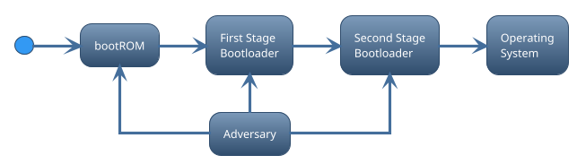
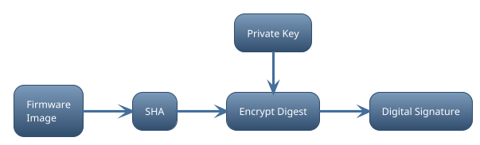
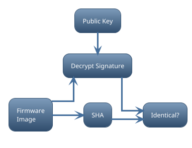

# Secure Boot

Security is a journey, not a destination.

## Abstract

Standard non-secure bootloaders often just rely on a simple checksum to ensure
the next image is whole before it is accepted and executed. From a security
perspective, this is quite dangerous as it provides no mechanism to protect the
embedded system from low-level malware and being seized by an adversary. Nearly
every embedded system requires some level of security to ensure the device
cannot be easily compromised or tampered with. This is especially true with the
prolifiration of Internet of Things (IoT) where applications are migrating to
edge devices. A single weak link may compromise the entire IoT infrastructure,
allowing adversaries to steal intellectual property and sensitive data, gain
unaothorized access to other inter-connected systems, or disrupt
business-critical operations.

Secure Boot represents the first layer (or barrier) for any layered security
approach and provides the initial boot-up protections to ensure only legitimate
firmware is allowed to execute before loading the Operating System (OS).
Developing a secure boot solution requires not only hardware support for
security related controls, but also embedded engineers with expert understanding
of the hardware capabilities and secure boot solutions needed to ensure
higher-layer security controls can be trusted.

## Acronyms

| Abbreviation | Meaning                                           |
| :----------- | :------------------------------------------------ |
| CoT          | Chain-of-Trust                                    |
| ECDSA        | Elliptic Curve Digital Signature Algorithm        |
| HSM          | Hardware Security Module                          |
| IoT          | Internet-of-Things                                |
| OEM          | Original Equipment Manufacturer                   |
| OS           | Operating System                                  |
| PKI          | Public Key Infrastructure                         |
| ROM          | Read-only Memory                                  |
| RoT          | Root-of-Trust                                     |
| RSA          | Rivest-Shamir-Adleman (A public-key cryptosystem) |

## Disclaimer

Any mention of commercial products or reference to commercial organizations is
for information only; it does not imply recommendation or endorsement by the
author(s), nor does it imply that the products mentioned are necessarily the
best available for the purpose.

## Scope

This document is mostly targeting Secure Boot for embedded systems such as
microcontrollers or application processors used in IoT edge devices. However,
many of the principles discussed within this document are applicable to other
general purpose computing systems.

## Audience

The primary audience for this document are embedded security engineers and
system architects. However, other hardware/software engineers may benefit from
reading this document as well.

## Introduction

A bootloader is a program that is executed on a device when it is powered on or
reset. Bootloaders come in many flavors and sizes, but in general bootloaders
aim to facilitate the following primary goals:

- Prepare the hardware and the runtime environment before loading the Operating
  System (OS) or main application.
- Allow the system software to be updated without the need for specialized
  hardware equipment such as a JTAG programmer.

A central boot program found in embedded processors is the Boot ROM - An
immutable piece of code stored in mask ROM or write-protected flash inside the
processor during production of the processor. It is the first significant code
that is executed by the processor after power-on or reset, and contains
instructions for initial hardware setup needed to boot the next image. Where and
how to load and execute the next image from (and in which order) is in many
cases configurable through strap pins, electronic fuses, or internal flash
settings. The Boot ROM may contain additional functionality, possibly extendable
to user code during or after boot, such as the ability to verify the next image
for validity and correctness before transitioning control. The capabilities of
the Boot ROM varies from processor to processor, but in most cases the Boot ROM
is not flexible enough to support complex boot-up requirements such as loading
an operating system from a file system. In most cases, more than one bootloader
is required to accomplish the task of updating or booting the system - A
so-called multi-stage boot process, where each stage in the boot sequence
executes its own boot program with specific set of capabilities and
responsibilities.

This is especially true for application processors capable of running embedded
Linux where the processor's On-Chip RAM (OCRAM) may not be large enough to hold
the bootloader (OS loader) responsible for loading the Linux kernel. A so-called
Secondary Program Loader (SPL) is used to prepare external RAM on which the OS
loader may be loaded and executed.

Regardless of the boot process topology, it's important to note that bootloaders
runs on the system with a very high level of privilege. Standard non-secure
bootloaders often just rely on a simple checksum to ensure the next image is
whole before it is allowed to execute. From a security perspective, this is
quite dangerous as it allows the presence of low-level malware.

Low-level malware targets boot firmware due to its unique role in setting up and
mainting device hardware security capabilities. If a device allows the precence
of low-level malware, it may enable adversaries to steal intellectual property,
credentials and other sensitive or confidential data. Low-level malware may do
so without leaving an audit trail, allowing the malicious program to run on the
device undetected for a prolonged period of time (if detected at all). It may
also serve as a starting point to compromise other devices in a distributed
system, or even worse, render the device unusable or permanently damaged which
can disrupt business and safety-critical operations - potentially leading to
substantial financial costs or health hazards.

Nearly every embedded system requires some level of security to ensure the
device cannot be easily compromised or tampered with. Secure Boot represents the
first layer for any layered security approach and provides the initial boot-up
protections to ensure higher-layer security controls can be trusted by only
allowing legitimate firmware to be executed.

## Secure Boot

The primary purpose of Secure Boot is to ensure only legitimate and authorized
firmware are allowed to execute before the OS (or main application) is loaded.
To prevent malicious code from compromising the boot process, Secure Boot relies
on a Chain-of-Trust (CoT) which originates from an immutable hardware level
Root-of-Trust (RoT). CoT is a method whereby each boot image is required to
cryptographically validate the digital signature of the next image (or any
pertinent boot component) against known and trusted keys before transitioning
control.

If a problem is detected during the secure boot process the bootloader halts the
system from booting further, and may initiate a recovery process to restore the
device back to a state of integrity. Recovery mechanisms may include loading an
older version that was previously known to work or allow recovery images to be
downladed locally or remotely through authenticated update mechanisms.

### Root-of-Trust

The Secure Boot CoT can only be trusted if it originates from an immutable
hardware-level RoT, which typically includes (but not limited to):

- A primary bootloader that supports Secure Boot
- A hardware-accelerated cryptographic engine
- A place to safely store trusted keys
- Security configuration settings

Preferably, the Boot ROM code should support Secure Boot considering that it is
already immutable and thus implicitly considered a trusted software component.
Note however, that Boot ROM code can, like any other piece of software, suffer
from security vulnerabilities and bugs which may impact the Secure Boot process.
Hence, it is important to check whether or not the processor has any known
security vulnerabilities during hardware selection. If the Boot ROM does not
natively support Secure Boot, which may be the case for microcontrollers, it may
be possible to extend the Boot ROM with a secure boot enabled bootloader stored
in a permanently write-protected flash area.

The trusted keys forms the basis of establishing trust in digital signatures
that are applied to images. Although these keys are the public counterparts of
the private keys used for signing images, it is important that signature
verification keys cannot be tampered with. Normally, such keys are embedded and
locked by OEM in one-time programmable memory (i.e. electrical fuses) during
device production to prevent the keys from being modified in the field.

Security settings includes policies and configuration settings that may alter
the behavior of the boot process. Such as what boot devices to boot from and in
what order, whether or not the processor allows direct boot to external memory,
or if debug ports are enabled. Make sure you familiarize yourself with the
processor and it's security reference manual.

### Digital signatures

Secure Boot leverages digital signatures to provide the following security
services:

- Data Integrity
- Source Authentication
- Non-repudiation

**Data Integrity** is a property whereby data has not been modified since it was
created, transmitted or stored. Digital signatures rely on Secure Hashing
Algorithms (SHA) to ensure data is in a state of integrity. Similar to checksums
(i.e. CRC32), SHA's detect accidental or intentional data corruption. However,
SHA's are designed to create unique digital fingerprints that are
computationally infeasible to forge and replace, thus making them suitable for
cryptographic operations.

**Source Authentication** provides assurance that the data originates from a
legitimate source (the private key-holder). This is achieved through use of
Public Key Cryptography (TODO: REF).

**Non-repudiation**, in a cryptographic sense, ... that the private key-holder
cannot deny having signed the data.

Code Signing

Code Verification

### Public Key Infrastructure

Some devices support Public Key Infrastructure (PKI), in which identity
verification can be leveraged to ensure the owner of the key is who they claim
to be.

TODO

## Other Responsibilities

Secure Boot is often tasked with several other security control mechanisms, such
as performing:

- Key revocation
- Rollback protection
- Authenticated updates

Normally, updating a system's firmware is managed by some application running as
part of the operating system. Sometimes however, a bootloader may provide
functionality that allows system firmware to be updated through a serial- or
network-based communication channel. In such cases it's important that the
bootloader protects the memory storage by requiring authenticated update
procedures before allowing the new firmware to be installed.

## Hardware selection

Every embedded device (ie. microcontroller or processor) have their nuances when
it comes to secure boot, but in general (although not an exhaustive list) the
following should be considered:

National Institute of Standards and Technology (NIST) is widely regarded as the
... (defacto standard) ... for security ...

- ECDSA
- RSA
- EdDSA

## Final words

Bootloaders in general are often overlooked and implemented late in the product
development cycle, despite being a complicated and critical component to
implement. Secure boot makes the effort even harder as you are responsible for
your own security, and the knowledge requirements a team needs to implement a
Secure Boot solution depends on whether or not a third-party or vendor provided
Secure Boot solution can be leveraged. It is critical that the implementation of
Secure Boot is started as early as possible in the development cycle
irrespective of using a third-party solution as it may take time to get familiar
with the security capabilities of the processor, and properly test and verify
successful implementation of Secure Boot.

Every microcontroller or processor have their nuances when it comes to Secure
Boot, so make sure you read and understand the security reference manual before
deciding whether the processor fits your security requirements. Preferably, you
should choose a processor which has built-in support for Root-of-Trust in
hardware to ensure secure boot cannot be circumvented.

More importantly, don't be fooled by a false sense of security. Secure Boot does
not lock the entire system down. It only secures the boot process until the OS
takes over. It is possible to write some malware that runs on top of the OS
which, if loaded successfully, could compromise the system. Additionally, secure
boot may be compromised if you fail to secure the private keys used for
generating digital signatures. For the device to maintain its security posture,
OEM's need to ensure the private keys are securely stored and properly protected
from unauthorized access.

Ensuring private keys are kept secret, protected and only accessible to trusted
users

In general (although not an exhaustive list) you should consider the following:

- Failing to burn the hash/keys into the processor properly
- Do you trust your EOL procedure and surrounding process?
- Using weak keys
- Not protecting the surrounding processes such as key storage and usage
- Not testing the secure boot implementation
  - Confirm the process is authenticating correctly (both positive and negative
    test cases)
  - Ensure code has been properly written for secure boot
  - TIP: Avoid dynamic allocation ...
  - It's better to take a known, good implementation of a secure bootloader and
    match it to your needs. ...Use a well tested and ... proprietary/community
    bootloader?
- Not authenticating all steps in the boot process
- Not write-protecting boot configuration settings

Secure Key Management (OEM)

- Protecting keys from unauthorized disclosure
- Access control and identity authentication
- Audit control

Secure Signing Environment (OEM)

- Protecting/Limit Key Management from unauthorized access.
- Only trusted personnel/machines have direct access to the Key management
  service.

Other (equally important) considerations:

1. Cryptographic algorithms and key strength
2. Key revocation and rollback protection
3. Code safety and reliability
4. Hardware based isolation
   - Security begins with isolation.
   - Isolate applications into different domains that each have their own
     privileges and access to only specific areas of memory.
   - Ie. on multicore processors one core could be dedicated to security
     features. ARM TrustZone provides isolation on single core...

## Secure Key Management

To maintain the security of a secure boot enabled device, protecting the private
key is critical. If the private key is known to an adversary, then secure boot
provides no security against executing malicious software. Secure Key Management
is the process of managing a key throughout its lifecycle, including its secure
generation, storage, distribution, use and destruction.

Industry best practices dictates ... use of ... certified (FIPS-140) Hardware
Security Modules.

--- FIPS-140 ---

So when a key is compromised, you have at most three options:

1. Revoke the compromised key such that devices in the field will not approve
   software signed with the key.
2. Or decommission/brick the device permanently, so it cannot be exploited by
   the adversary.
3. Or accept the fact that you cannot prevent malicious software from being
   installed (same as with non-secure/normal boot).

Option 1 is preferred if your device supports multiple sets of keys and has key
revocation capabilities (either through electrical fuses or through an internal
database of revoked keys). If your device does not support key revocation
mechanisms then option 2 is the preferred choice, but this might depend on the
purpose of the device. Option 3 is not really an option, but you run it at your
own risk.

- Implications of key compromise?

Secure Boot is "secure" only if the algorithms remain strong and the keys have
not been compromised. Key compromise occurs when the key can no longer be
trusted to provide the required security, i.e. as a result of failing to protect
the key from an adversary. If a key is compromised, all use of the key shall
cease, and the compromised key shall be revoked.

However, if digital signatures have been time-stamped ... blablabla... Normally,
small embedded microcontrollers/processors usually doesn't implement mechanisms
to adhere to time-stamped... simply because it relies on having an accurate
knowledge of the current time (which is generally not known during the early
boot process on such devices).

Key revocation is the process of letting devices know whether a key is still
safe to use...

- Lifetime of a signing key?
- Lifetime of a digital signature?
- Access control (Restrict resource access to only authorized entities)
- Accountability
  - Holding individuals who has been assigned key management responsibilities
    accountable
  - Ensure the actions of an entity may be traced uniquely to that entity
- Key Revocation

Secure Key Management!

- Access control
- Audit control
- Offload cryptographic operations

## OEM requirements

Series of tasks during manufacturing

- Provisioning secure boot keys
- Blowing configuration fuses
  - JTAG
  - Enable secure boot
  - Test access (i.e. vendor specific test access)
  - etc...

Other considerations

- Replay Protected Memory Block (RPMB)
  - Bind specific eMMC part and the SoC component in the device together.
    Prevents reuse of eMMC in another device with an OS that makes use of the
    RPMB.

## Conclusion

The lack of focus on implementing bootloaders in early development is primarily
because the bootloader is not the primary end product that provides the services
sold to customers. Secure boot makes the effort even more complicated as you're
responsible for your own security, and even a simple bug or mistake may be
detrimental to the security and integrity of your product.

> Rule #1: Start secure boot and bootloader development as early as possible

> Rule #2: Use trusted third-party or vendor provided secure boot solutions if
> possible

- Every microcontroller or application processor have their nuances when it
  comes to secure boot.
- At the very least, given an experienced developer familiar with secure boot,
  you should estimate 6-8 weeks of work. Using third-party or vendor provided
  secure boot solutions decreases the knowledge requirements a team needs in
  order to implement a secure boot solution on their device. If those solutions
  are not enough, it is critical that the implementation of secure boot is
  started as early as possible as it may take several months to ensure the
  secure bootloader is built, tested and verified successfully.
- This may take even longer if you do not have the infrastructure to support
  secure boot in place either. Such as a secure key management solution, or a
  process (including code signing tools) for generating digital signatures.

Using weak keys .... bla bla

> Rule #TODO: Ensure you select a strong key-pair ... (see NIST) ... over the
> life-time of the product.

> Rule #TODO: Ensure private keys are kept secret, protected and only accessible
> to trusted entities.

> Rule #TODO: Ensure you have a proper plan for key revocation before product is
> released to market.

- False sense of security
  - Secure Boot does not lock the entire system down. It only secures the boot
    process until the OS takes over. It's possible to write some malware that
    runs on top of the OS which, if loaded successfully, could compromise the
    system.
- Using signature keys for more than just signing... undermines the security?
- Not following the security recommendations of the vendor?
  - Or not understanding the security limitations of your processor.
- Not protecting the surrounding processes such as key storage and usage
- Not testing the secure boot implementation
  - Confirm the process is authenticating correctly (both positive and negative
    test cases)
  - Ensure code has been properly written for secure boot
  - TIP: Avoid dynamic allocation ...
  - It's better to take a known, good implementation of a secure boot loader and
    match it to your needs. ...Use a well tested and ... proprietary/community
    boot loader?
- Not authenticating all steps in the boot process
- Not write-protecting boot configuration settings
- Make sure your silicon version does not have errata that may compromise the
  secure boot process.
  - nRF52 example?

Don't be fooled by a false sense of security. Secure boot, if implemented
properly, ensures only authorized firmware is allowed to run on the device.
However, ... the device can be compromised if security policies or ... in the
OS/application is not ... implemented correctly ...

Should also consider:

- Secure storage
  - Protection against reverse engineering
  - Protection against leaking sensitive data such as encryption keys, user and
    service credentials and other system or customer data.
  - The purpose of secure storage is to prevent private/sensitive data from
    being leaked such that it can be used or cloned by adversaries.

List of well known and tested implementations (TODO verify):

IMPORTANT: Check any security advisories for the secure boot implementation.

|     name | vendor | architecture |
| -------: | ------ | ------------ |
|   U-Boot | ...    | ARM, ...     |
| WolfBoot | ...    | ...          |
|  MCUboot | ...    | 32-bit MCUs  |
|     UEFI | ...    | x86, ...     |

What if bootROM does not validate boot loader?

## Other considerations

0. Encrypted Boot
1. Measured Boot And Remote Attestation
2. Trusted Boot
3. Verified Boot
4. OPTEE
5. ...

On a much broader scale, as outlined by "NIST SP 800-193. Platform Firmware
Resiliency Guidelines" [5], cyber resiliency not only requires proper protection
mechanisms, but also proper recovery and detection mechanisms.

## Resources

- [1]
  [NIST Key Management Guidelines](https://csrc.nist.gov/Projects/Key-Management/Key-Management-Guidelines)
- [2]
  [SP 800-57 Part 1](https://csrc.nist.gov/publications/detail/sp/800-57-part-1/rev-5/final)
- [3]
  [5 Elements to Secure Embedded System (part 1-5)](https://www.beningo.com/5-elements-to-secure-embedded-systems-part-1-hardware-based-isolation/)
- [4]
  [Hardware-Enabled Security](https://nvlpubs.nist.gov/nistpubs/ir/2022/NIST.IR.8320.pdf)
- [5]
  [Platform Firmware Resiliency Guidelines](https://nvlpubs.nist.gov/nistpubs/SpecialPublications/NIST.SP.800-193.pdf)
- [6]
  [Fundamentals of Booting Embedded Processors](https://www.embedded.com/fundamentals-of-booting-for-embedded-processors)
