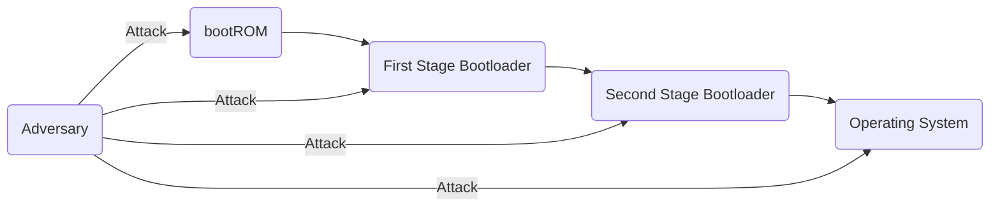
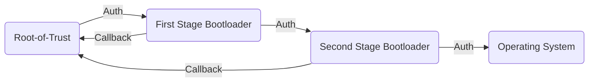
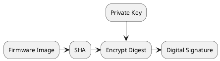
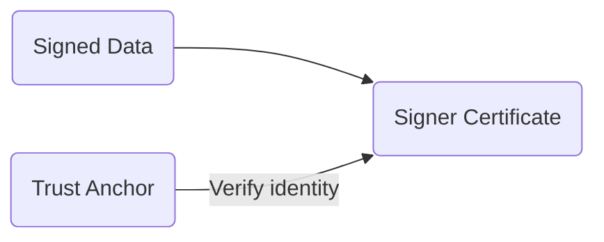
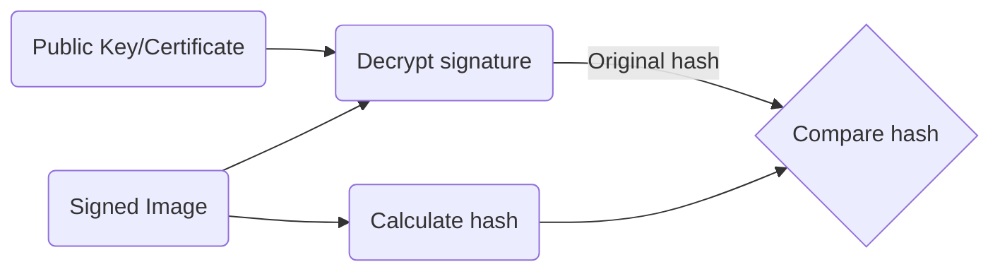

# Secure Boot

State of this document: WIP

## Abstract

Standard (non-secure) bootloaders often just rely on a checksum to ensure the image loaded is whole
before it is accepted and executed. From a security perspective, this is quite dangerous as it
provides no mechanism to protect the embedded system from malware or being hijacked by an adversary.
Nearly every embedded system requires some level of security to ensure the device cannot be easily
compromised or tampered with. This is especially true with the proliferation of embedded Internet of
Things (IoT) devices (edge devices) being integrated into larger IoT-enabled infrastructure and
environments. A single weak link may compromise the entire IoT infrastructure, allowing adversaries
to steal sensitive data and disrupt business-critical operations.

Secure Boot represents the first layer (or barrier) for any layered security approach and provides
the initial boot-up protections to ensure that only legitimate firmware and higher-layer security
controls can be trusted. Developing secure boot requires not only hardware support for security
related controls, but also embedded engineers with expert understanding of the hardware capabilities
and secure boot solutions.

## Acronyms

|       |                                                     |
| ----- | --------------------------------------------------- |
| ECDSA | Elliptic Curve Digital Signature Algorithm          |
| HSM   | Hardware Security Module                            |
| IoT   | Internet-of-Things                                  |
| OEM   | Original Equipment Manufacturer                     |
| OS    | Operating System                                    |
| PKI   | Public Key Infrastructure                           |
| ROM   | Read-only Memory                                    |
| RoT   | Root-of-Trust                                       |
| RSA   | Rivest-Shamir-Adleman (A public-key cryptosystem)   |

## Disclaimer

Any mention of commercial products or reference to commercial organizations is for information
only; it does not imply recommendation or endorsement by the author(s), nor does it imply that
the products mentioned are necessarily the best available for the purpose.

## Scope and Audience

The target audience for this document are embedded security engineers and system architects.
However, other hardware/software engineers may benefit from reading this document as well.

## Introduction

TODO
- What is the purpose of a bootloader?
- When and why do we need a bootloader?
- How does the boot process work from start to finish
- Images/Diagrams
- References

A bootloader is a piece of software (program) that is executed on a device when it is powered on
or reset. Bootloaders come in many flavors, but in general the main purpose of bootloaders is to
prepare the hardware and the environment on which the Operating System (OS) or main application
runs on. Depending on the processor, the boot process may be split into one or more boot stages
before the OS is loaded - Each stage executing its own boot program with a specific set of
responsibilities.


A central piece of boot software found in most embedded processors is the bootROM - An immutable vendor-provided
implementation stored in mask ROM or write-protected flash inside the processor. The bootROM is the first
significant code that runs on an embedded device after power-on or reset.

Depending on the configuration of some
strap pins or internal fuses it may decide from where to load the next part of the code to be executed and how
or whether to verify it for correctness or validity. Sometimes it may contain additional functionality, possibly
usable by user code during or after booting.

The bootROM may ... extend ... it's capabilities, allowing subsequent boot software components
to leverage ... features ... provided by the bootROM. This includes ... the cryptographic engine ...
reading OTP fuses ... 

... initializing registers to access boot medium (external, internal)

Performs initial hardware setup before transitioning control to the next image.

The capabilities of a bootROM varies from processor to processor.

In many cases, the bootROM is not flexible enough to support complex boot-up procedures.

In application processors, capable of running embedded Linux, a bootROM is generally not flexible
enough to boot the entire Linux kernel. In such cases, a multi-stage bootloading environment
comprising of one or more boot stages is often required.

Secondary Program Loader (SPL)
   - Performs additional hardware setup (i.e. external RAM)
   - Usually required on processors capable of supporting i.e. embedded linux
   - A minimal implementation that fits into OCRAM
   - Responsible for starting the OS loader

OS loader
  - Performs additional hardware setup
  - Responsible for loading and starting the OS
  - Mutable by default (can be updated)
  - Can support more complex requirements
  -- Load the OS from external non-volatile memory
  -- Support different communication channels (serial, network)
  -- Implement interactive shell
  -- etc..

Problems

  - Most modern embedded devices allow the firmware to be updated,
    either locally or remotely (or both).
  - Bootloaders runs on the system with a very high level of privelege
  - Standard (non-secure) bootloaders often just rely on a checksum to ensure
    the next image is whole before it is allowed to execute.

  From a security perspective, this is quite dangerous as it allows the
  presence of low-level persistent malware!




Low-level malware may

  - Allow adversaries to steal intelectual property, credentials, etc.
  - Have the potential to render the system unusable or permanently damaged
  - Serve as a starting point to compromise other systems
  - Possibly undetectable from OS, users, OEM, etc., for a long period of time
  - Disrupt business-critical operations
  - Lead to substantial costs
  - etc...

  > Conclusion
  > 
  > Nearly every embedded system requires some level of security to ensure the
  > device cannot be easily compromised or tampered with.


## Secure Boot
The primary purpose of Secure Boot is to ensure only legitimate and authorized firmware are
allowed to execute before the Operating System (OS, or main application) is loaded. Hence,
preventing malicious software from compromising the boot process.

Secure Boot relies on a Chain-of-Trust (CoT) which originates from an immutable hardware level
Root-of-Trust (RoT). CoT is a method whereby each boot software module is required to cryptographically
validate the digital signature of the next module (or any pertinent boot component) against known
and trusted keys before transitioning control.




The known keys are usually determined by the device manufacturer (OEM).

If a problem is detected during the secure boot process, the bootloader may either halt the system
from booting further or it may try to load an earlier version of the code that was known to work.

  More broadly, we want Secure Boot to have the following reciliency
  properties:

  - Detection
  - Protection
  - Recovery

### Root-of-Trust

The Chain-of-Trust can only be trusted if it originates from an immutable Root-of-Trust, which
typically includes:

- A primary bootloader implementing secure boot
- Hardware cryptographic engine
- A place to immutably store trusted keys or certificates
- True random number generators (TRNG)?
- Hardware isolation?
- Critical boot configuration settings are properly configured and write-protected.

When an embedded system is powered on or reset, we want to ensure that the first

If possible, we want the RoT to first be established by the 

On modern processors this is often provided by the vendor through bootROM
On microcontrollers you would typically install the secure bootloader in
a write-protected (to make it immutable) area in flash.

It's important that Root-of-Trust is immutable...

## Digital signatures

Secure Boot leverages digital signatures to provide the following security services:

- **Data Integrity** - A property whereby data has not been modified since it was created, transmitted or stored.
- **Source Authentication** - Provides assurance that the data originates from a legitimate source (the private key holder).
- **Non-repudiation** - The private key holder cannot deny having signed the data.

Similar to checksums (i.e. CRC32), cryptographic hash functions (SHA) detects accidental or
intentional data corruption. However, cryptographic hash functions posess additional properties making them suitable for ... such as digital signatures.
Informally, cryptographic hash functions ensures that a malicious adversary connot easily replace or modify the original
data to produce the same digest (TODO: REFERENCE).

Code Signing



Code Verification


## Other Responsibilities

Secure Boot is often tasked with several other security control mechanisms, such as performing:

- Key revocation
- Rollback protection
- ...?

## Hardware selection

Every embedded device (ie. microcontroller or processor) have their nuances when it comes to secure boot, but in general
(although not an exhaustive list) you should consider the following:

- Crypto hardware accelleration with support for keys with strong security ...
- Certified built-in cryptographic libraries
- Built-in Root-of-Trust in hardware
- Reverting back to a known good state...

- Supply-chain attacks? Cloning of firmware, replacing keys, dummy chips,...

## Key and algorithm selection

National Institute of Standards and Technology (NIST) is widely regarded as the ... (defacto standard) ...
for security ...

- ECDSA
- RSA
- EdDSA


## Pitfalls

Bootloaders in general are often overlooked and implemented late in the product development cycle,
despite being a complicated and critical component to implement. Secure boot makes the effort even
harder as you are responsible for your own security and a small bug may have ... implications on system integrity.

Every microcontroller or processor have their nuances when it comes to secure boot.

In general (although not an exhaustive list) you should consider the following:

- Crypto hardware accelleration with support for keys with strong security ...
- Built-in Root-of-Trust in hardware
  - At the very least, given an experienced developer familiar with secure boot, you
    should estimate 6-8 weeks of work. Using third-party or vendor provided secure boot
    solutions decreases the knowledge requirements a team needs in order to implement a
    secure boot solution on their device. If those solutions are not enough, it is critical
    that the implementation of secure boot is started as early as possible as it may take
    several months to ensure the secure bootloader is built, tested and verified successfully.
  - This may take even longer if you do not have the infrastructure to support secure boot in
    place either. Such as a secure key management solution, or a process (including code signing
    tools) for generating digital signatures.

- You are responsible for your own security.
  - Selecting a strong key
  - Ensuring private keys are kept secret, protected and only accessible to trusted users
- Failing to burn the hash/keys into the processor properly
  - Do you trust your EOL procedure and surrounding proccess?
- False sense of security
  - Secure Boot does not lock the entire system down. It only secures the boot process until
  the OS takes over. It's possible to write some malware that runs on top of the OS which, if
  loaded successfully, could compromise the system.
- Using weak keys
- Using signature keys for more than just signing... undermines the security?
- Not following the security recommendations of the vendor?
  - Or not understanding the security limitations of your processor.
- Not protecting the surrounding processes such as key storage and usage
- Not testing the secure boot implementation
  - Confirm the process is authenticating correctly (both positive and negative test cases)
  - Ensure code has been properly written for secure boot
  - TIP: Avoid dynamic allocation ...
  - It's better to take a known, good implementation of a secure boot loader and match it to your needs.
    ...Use a well tested and ... proprietary/community boot loader?
- Not authenticating all steps in the boot process
- Not write-protecting boot configuration settings
- Make sure your silicon version does not have errata that may compromise the secure boot process.
  - nRF52 example?

Secure Boot Infrastructure is comprised of three ... integral parts ... to ensure a device, on which secure boot is implemented,
cannot (or the risk is reduced to a minimum) be compromised.

1. Secure Boot (device)
   - HW root of trust
   - SW root of trust
   - Boot configuration settings
2. Secure Key Management (OEM)
   - Protecting keys from unauthorized disclosure
   - Access control and identity authentication
   - Audit control
3. Secure Signing Environment (OEM)
   - Protecting/Limit Key Management from unauthorized access.
   - Only trusted personel/machines have direct access to the Key management service.

Other (equally important) considerations:

1. Cryptographic algorithms and key strength
   - Weak ...
2. Key revocation and rollback protection
3. Code safety and reliability
2. Hardware based isolation
   - Security begins with isolation.
   - Isolate applications into different domains that
     each have their own privileges and access to only
     specific areas of memory.
   - Ie. on multicore processors one core could be dedicated to security
     features. ARM TrustZone provides isolation on single core...


If Secure Boot has been properly implemented on a target device, then what attack vectors do we have left to exploit?


KEY SIZES and approved algorithms: See FIPS 186

## Secure Boot

The responsibility of Secure Boot is to ensure only authorized code can execute before the OS is loaded,
thus preventing malicious software (such as rootkits) from being loaded. Secure Boot cryptographically
validates the digital signature of all boot components against known/trusted keys, starting from the
primary boot loader, to one or more intermediate boot loading stages, and finally to the OS and all
components that run it (i.e. drivers and applications).

To ensure a device is securily booting only trusted and legitimate code, a chain of trust must be established
which originates from an immutable Root-of-Trust.

Root-of-Trust ...:
- Primary Boot Loader (vendor bootROM implementation)
- Electrical fuses to store hash of trusted OEM public keys/certificates
- Boot configuration settings

> It's important that Root-of-Trust is immutable. This includes the primary boot loader,
> hash and boot configurations. If any of these are mutable, the Root-of-Trust can be compromised.

Secure Boot leverages digital signatures to provide the following security services:

- **Data Integrity**
  - A property whereby data has not been modified since it was created, transmitted or stored.
- **Source Authentication**
  - Used to verify the identity of the entity that created and/or sent information.
- **Identity Authentication**
  - If combined with a PKI system?
  - ...?
- **Non-repudiation**
  - If combined with a PKI system
  - binds the name of the certificate subject to a public key... Signer is who they claim to be.

A Chain-of-Trust must be established and originate from the Root-of-Trust (hardware).
To establish trust between ... Root-of-Trust ... 


In case a problem is detected during the boot process, ... may either halt the system from booting
further or it may try to load an earlier version of the code that was known to work.

The known keys are usually determined by the device manufacturer (OEM).




### Hardware Root-of-Trust


Root-of-Trust is the first foundational link in a Chain-of-Trust...

Keys (or certificates) are normally stored in electrical fuses as a secure hash.

TODO:
- Is it possible to have Root-of-Trust on devices which doesn't have Root-of-Trust built-in
  to the microcontroller/processor?

Establish root of trust.

Once programmed the keys and configuration settings must be immutable!

- Hardware Root-of-Trust
  - eFuse
    - One-time programmable
    - write-protection (immutable - cannot be changed or erased)
  - public keys / certificates
  - configuration fuses
- Software Root-of-Trust
  - bootROM
  - certified cryptographic algorithm implementations
  - ...

- immutable keys/certificates on which the signature verification is based on
- Normally stored in electrical fuses which are write-protected after being burned, thus
ensuring the keys cannot be tampered with. Similarily, essential boot configuration settings
are also locked, ensuring it cannot be tampered with.

### Software Root-of-Trust

- immutable (vendor) code that ensures boot configuration settings are adhered to.
- If secure boot is enabled, the bootROM will ensure the next boot component is valid before
allowing it to execute (ensures the initial boot-up is protected)

### Boot Configuration Settings

SECURITY HARDENING!!

### Public Key Infrastructure

- Some devices supports Public Key Infrastructure (PKI), in which identity verification can be leveraged
to ensure the owner of the key is who they claim to be.


Hardware Root of Trust ... Some devices may also support Public Key Infrastructure (PKI).


## Secure Key Management

To maintain the security of a secure boot enabled device, protecting the private key is critical. If the private key
is known to an adversary, then secure boot provides no security against executing malicious software (i.e. rootkits).
Secure Key Management is the process of managing a key troughout its lifecycle, including its secure generation,
storage, distribution, use and destruction.

Protection of the private key used for generated digital signatures. This ... both having direct access
to the private key material (in plaintext) or having credentials that allow an adversery to use the protected key.

Industry best practices dictates ... use of ... certified (FIPS-140) Hardware Security Modules.


--- FIPS-140 ---

So when a key is compromised, you have at most three options:

1. Revoke the compromised key such that devices in the field will not approve software signed with the key.
2. Or decomission/brick the device permanently so it cannot be exploited by the adversary.
3. Or accept the fact that you cannot prevent malicious software from being installed (same as with non-secure/normal boot).

Option 1 is preferred if your device supports multiple sets of keys and has key revocation capabilities (either through
electrical fuses or through an internal database of revoked keys). If your device does not support key revocation mechanisms
then option 2 is the preferred choice, but this might depend on the purpose of the device. Option 3 is not really an option,
but you run it at your own risk.

So what measures do we have to ensure the private key is protected?

1. HSM
2. ...


- Implications of key compromise?

Secure Boot is "secure" only if the algorithms remain strong and the keys have not been compromised.
Key compromise occurs when the key can no longer be trusted to provide the required security, i.e.
as a result of failing to protect the key from an adversary. If a key is compromised, all use of the
key shall cease, and the compromised key shall be revoked.

However, if digital signatures have been time-stamped ... blablabla... Normally, small embedded microcontrollers/processors
usually doesn't implement mechanisms to adhere to time-stamped... simply because it relies on having an accurate knowledge
of the current time (which is generally not known during the early boot process on such devices).

Key revocation is the process of letting devices know whether a key is still safe to use...

- Lifetime of a signing key?
- Lifetime of a digital signature?
- Access control (Restrict resource access to only authorized entities)
- Accountability 
  - Holding individuals who has been assigned key management responsibilities accountable
  - Ensure the actions of an entity may be traced uniquely to that entity
- Key Revocation

Secure boot is the process of cryptographically validating all boot components before the operating system
is loaded.

Public Key Cryptography


Why use it?
When to use it?
- When device can be updated


Secure Key Management!
- HSM
- Vault
...
Secure Signing Environment!
- Access control
- Audit control
- Code signing
What keys to use? NIST, etc.. ? RSA vs ECDSA?
Key revocation!
- eFuse





## OEM requirements

Series of tasks during manufacturing
- Provisioning secure boot keys
- Blowing configuration fuses
  - JTAG
  - Enable secure boot
  - Test access (i.e. vendor specific test access)
  - etc...


Other considerations
- Replay Protected Memory Block (RPMB)
  - Bind specific eMMC part and the SoC component in the device together. Prevents
    reuse of eMMC in another device with an OS that makes use of the RPMB.

## Multistage bootloading

In each stage, the bootloader preceeding is responsible for authenticating the next image before
allowing it to be executed. Additionally, it can be required to authenticate additional images
such as device tree, ramdisk image, scripts, environment/configuration files, etc...

Primary bootloader (vendor)
First stage bootloader (custom)
Second stage bootloader (custom)
...


```mermaid
A(Primary Boot Loader) -->|Authenticate| B(First Stage Boot Loader)
B -->|Authenticate| C(Second Stage Boot Loader)
C -->|Authenticate| D(Main OS)
```

## Conclusion

### Pitfalls

- Bootloaders in general are often overlooked and implemented late in the product development,
  despite the bootloaders being a complicated and critical component to implement. Secure boot
  makes the effort even harder as you are responsible for your own security and a small bug
  may have ... implications on system integrity.
  - Every microcontroller or processor have their nuances when it comes to secure boot.
  - At the very least, given an experienced developer familiar with secure boot, you
    should estimate 6-8 weeks of work. Using third-party or vendor provided secure boot
    solutions decreases the knowledge requirements a team needs in order to implement a
    secure boot solution on their device. If those solutions are not enough, it is critical
    that the implementation of secure boot is started as early as possible as it may take
    several months to ensure the secure bootloader is built, tested and verified successfully.
  - This may take even longer if you do not have the infrastructure to support secure boot in
    place either. Such as a secure key management solution, or a process (including code signing
    tools) for generating digital signatures.

- You are responsible for your own security.
  - Selecting a strong key
  - Ensuring private keys are kept secret, protected and only accessible to trusted users
- Failing to burn the hash/keys into the processor properly
  - Do you trust your EOL procedure and surrounding proccess?
- False sense of security
  - Secure Boot does not lock the entire system down. It only secures the boot process until
  the OS takes over. It's possible to write some malware that runs on top of the OS which, if
  loaded successfully, could compromise the system.
- Using weak keys
- Using signature keys for more than just signing... undermines the security?
- Not following the security recommendations of the vendor?
  - Or not understanding the security limitations of your processor.
- Not protecting the surrounding processes such as key storage and usage
- Not testing the secure boot implementation
  - Confirm the process is authenticating correctly (both positive and negative test cases)
  - Ensure code has been properly written for secure boot
  - TIP: Avoid dynamic allocation ...
  - It's better to take a known, good implementation of a secure boot loader and match it to your needs.
    ...Use a well tested and ... proprietary/community boot loader?
- Not authenticating all steps in the boot process
- Not write-protecting boot configuration settings
- Make sure your silicon version does not have errata that may compromise the secure boot process.
  - nRF52 example?

Don't be fooled by a false sense of security. Secure boot, if implemented properly, ensures only
authorized firmware is allowed to run on the device. However, ... the device can be compromised
if security policies or ... in the OS/application is not ... implemented correctly ...

Should also consider:
- Secure storage
  - Protection against reverse engineering
  - Protection against leaking sensitive data such as encryption keys, user and
    service credentials and other system or customer data.
  - The purpose of secure storage is to prevent private/sensitive data from being
    leaked such that it can be used or cloned by adversaries.


List of well known and tested implementations (TODO verify):

IMPORTANT: Check any security advisories for the secure boot implementation.

| name     | vendor | architecture |
|-------:  | ------ | ------------ |
| U-Boot   | ...    | ARM, ...     |
| WolfBoot | ...    | ...          |
| MCUboot  | ...    | 32-bit MCUs  |
| UEFI     | ...    | x86, ...     |

What if bootROM does not validate boot loader?

## Other considerations

0. Encrypted Boot
1. Measured Boot And Remote Attestation
2. Trusted Boot
3. Verified Boot
4. OPTEE
5. ...

## Resources

- [1] [NIST Key Management Guidelines](https://csrc.nist.gov/Projects/Key-Management/Key-Management-Guidelines)
- [2] [SP 800-57 Part 1](https://csrc.nist.gov/publications/detail/sp/800-57-part-1/rev-5/final)
- [3] [5 Elements to Secure Embedded System (part 1-5)](https://www.beningo.com/5-elements-to-secure-embedded-systems-part-1-hardware-based-isolation/)
- [4] [Hardware-Enabled Security](https://nvlpubs.nist.gov/nistpubs/ir/2022/NIST.IR.8320.pdf)
- [5] [Platform Firmware Resiliency Guidelines](https://nvlpubs.nist.gov/nistpubs/SpecialPublications/NIST.SP.800-193.pdf)
- [6] [Fundamentals of Booting Embedded Processors](https://www.embedded.com/fundamentals-of-booting-for-embedded-processors)
